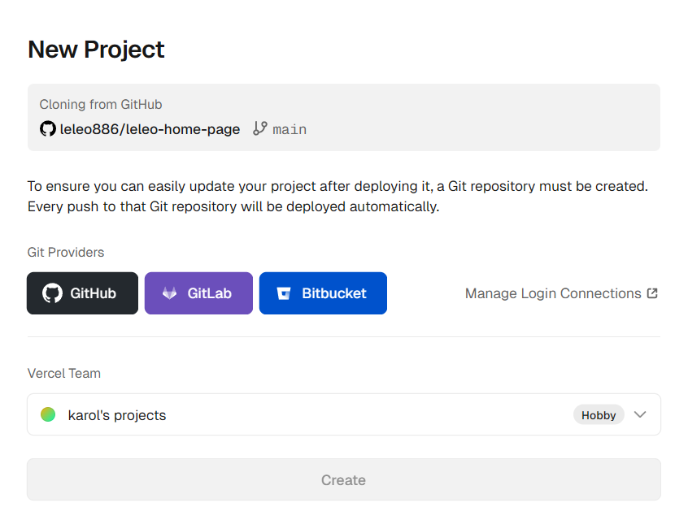
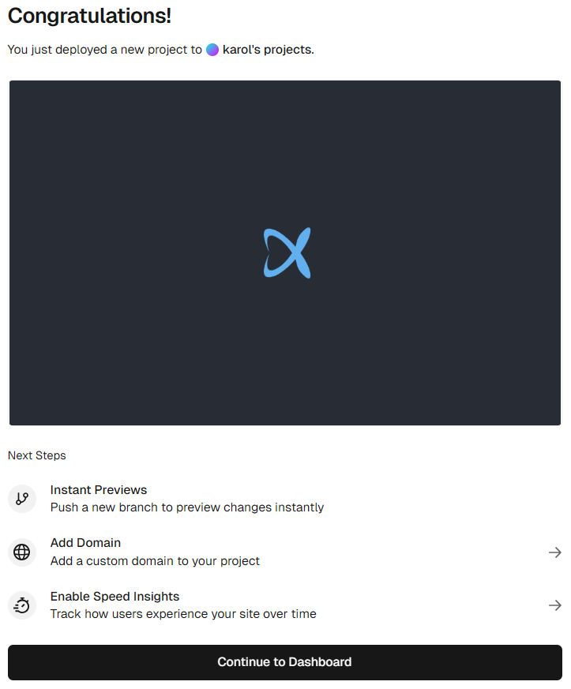
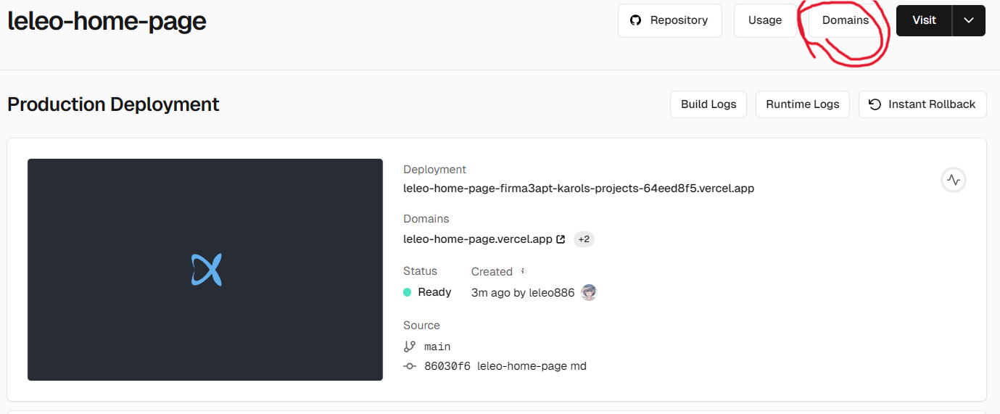
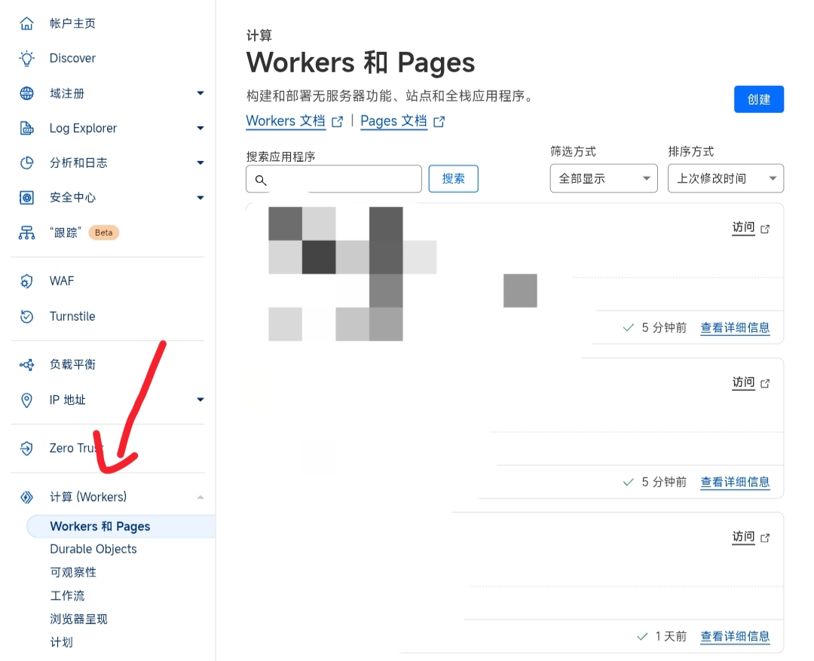
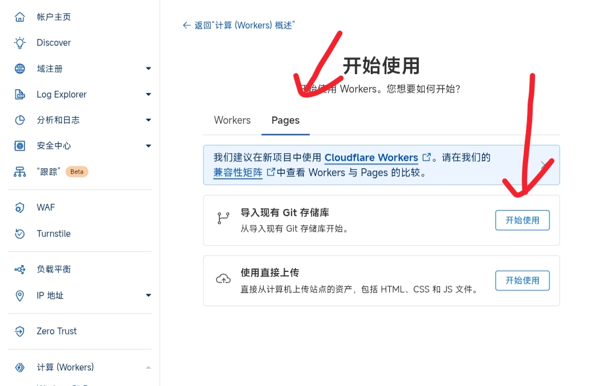
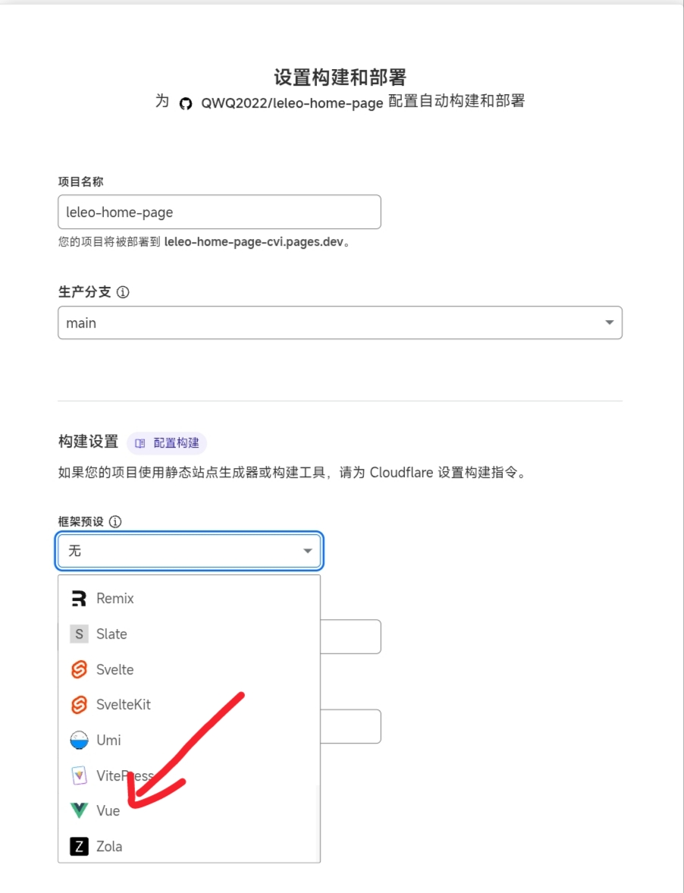
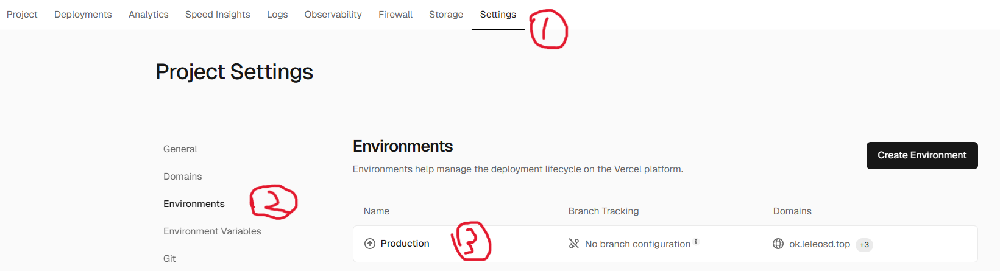
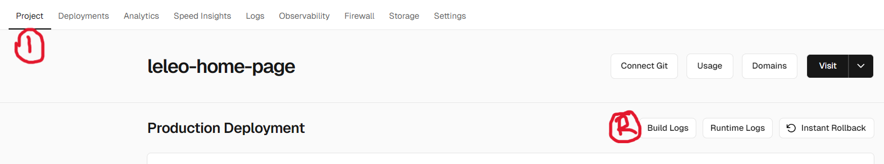
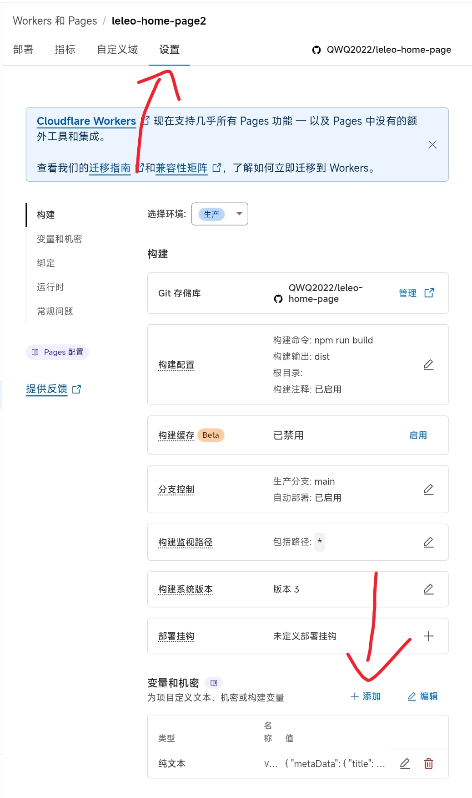
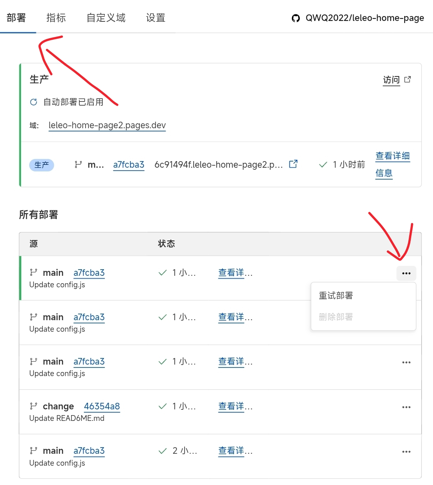

# 🌟 DazzlingDust 个人主页

<div align="center">


**一个现代化的个人主页，展现独特的设计美学与交互体验**

</div>

## ✨ 特色功能

### 🎨 视觉设计
- **玻璃拟态设计** - 现代化毛玻璃效果，营造层次感
- **响应式布局** - 完美适配桌面端、平板和移动设备
- **动态背景** - 支持静态图片和动态视频背景
- **主题切换** - 多种精美预设主题可选

### 💫 交互体验  
- **打字机效果** - 动态语录展示，支持API实时获取
- **音乐播放器** - 集成网易云音乐，支持歌单播放
- **3D转盘效果** - 鼠标悬停头像的音乐播放器动效
- **流畅动画** - 页面切换和元素交互的流畅过渡

### 📊 数据展示
- **GitHub统计卡片** - 实时展示GitHub活动数据
- **访问统计** - 集成萌萌计数器显示访问量
- **技能展示** - 个人技能标签云展示
- **项目展示** - 精美的项目卡片布局

### 🛠️ 开发特性
- **零配置部署** - 支持Vercel/CloudFlare一键部署
- **环境变量配置** - 在线修改无需重新构建
- **模块化设计** - 组件化开发，易于维护扩展
- **TypeScript支持** - 更好的开发体验和代码质量

## 🚀 快速开始

### 本地开发

```bash
# 克隆项目

# 安装依赖（推荐使用pnpm）
pnpm install
# 或者使用 npm install

# 启动开发服务器
pnpm dev
# 或者 npm run dev
```

### Vercel在线部署

> 无需服务器，点击链接一键在线部署到 [Vercel](https://vercel.com/new/clone?s=https://github.com/DazzlingDust886/DazzlingDust-home-page.git)（首先需要有github和vercel账号）



> ---登录vercel账号，并选择github关联账号，为项目取个名字，然后点击"Create"按钮开始部署



> ---部署完成后，点击回到控制面板



注意：Vercel提供的`.vercel.app`域名在中国大陆地区可能无法访问，所以建议绑定自定义域名。（若没有自己的域名，这里提供简单的[免费二级域名服务](https://sds.DazzlingDust.top)及本项目如何进行域名绑定的[说明](./img/domainToVercel.md)）

### CloudFlare Pages 在线部署

> 无需服务器，对站长友好(需要有CloudFlare以及Github账号)

1. Fork本项目到自己的账号下
   
2. 登录CloudFlare并点击左侧栏目中"计算(workers)"底下的"Workers 和 Pages"



3. 点击右上角"创建"，选择"Pages"，点击"导入现有 Git 存储库"右侧的"开始使用"



4. 点击"连接 Github"，并登录你的 Github 账号

5. 选择项目存储库(如果你没有更名那应该是"DazzlingDust-home-page")并开始设置，在接下来的页面中框架预设选择`Vue`(如果不选择，你的网站会访问为空白)，点击保存并部署



此时，项目已经部署完成，可以直接点击上方链接预览

如果需要绑定域名，可以点击"添加自定义域"、"设置自定义域"并填入目标域，点击继续

> 你的域名托管在CloudFlare，直接点击"激活域"就可以完成

> 你的域名没有托管在CloudFlare，根据指引添加CNAME记录即可

## 修改配置

### 方法1. 修改配置文件

自定义数据文件为项目src目录下面的 config.js，这里有[配置说明](./img/config.md)，然后就是代码的拉取、修改上传。如果部署方式为CloudFlare Page，直接在Github修改后Commit即可自动部署

**若使用此方法请勿配置环境变量**

### 方法2. 在线修改环境变量

**注意**：在vercel中此方法优先级高于方法1，CloudFlare中方法1优先级更高

#### vercel部署

> (1). 首先还是打开vercel中本项目主面板，然后依次点击`Settings`、`Environments`、`Production`


> (2). 然后下翻点击`Add Environment Variable`按钮，要求填入`Key`值为`VITE_CONFIG`,`Value`值如[环境变量值](./img/env.md)所示，全部复制粘贴即可（有点多），根据个人情况自定义修改，配置说明同方法1。


> (3). 回到项目主面板，依次点击`Project`、`Build Logs`，进入新页面后再找到`Redeploy`。最后等待重新部署完成即可。



#### CloudFlare部署

> (1). 到你的Pages项目，点击"设置"，找到"变量和机密"点击右侧"添加"


> (2). 要求填入"变量名称"为`VITE_CONFIG`,"值"如[环境变量值](./img/env.md)所示，全部复制粘贴即可（有点多），根据个人情况自定义修改，配置说明同方法1

> (3). 点击"部署"，找到左侧带绿条的那个点击右侧三个点"重试部署" 等待部署完成即可

